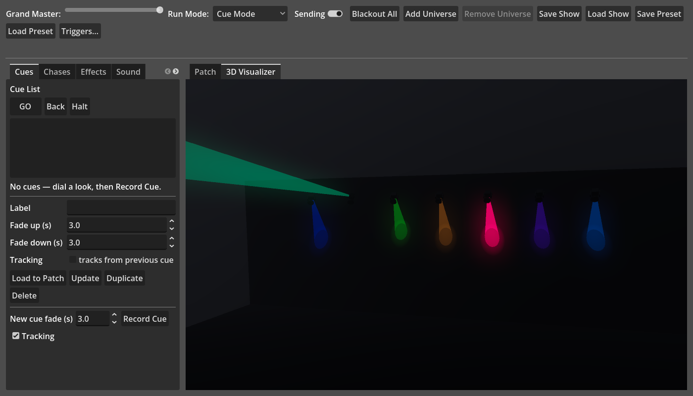

# Godot DMX Lighting Controller

A ready-to-run Godot 4 project with a GUI for controlling DMX lighting
fixtures. Each universe outputs over **Art-Net** or **sACN (E1.31)** —
both plain UDP, no plugin needed — or, with the optional `addons/usb_dmx`
GDExtension built, straight to a **USB DMX interface** (Enttec, Open DMX,
uDMX). Two more optional GDExtensions speed things up locally:
`addons/video_rec` records the 3D view to MP4, and `addons/song_dsp`
decodes and analyses a music file for the Auto Show in C++ instead of
playing it 4× through a capture bus. The app runs fine without any of them.

## What's included

- `project.godot` — project config (Forward+ renderer, for volumetric
  beams; audio input enabled), registers `artnet_sender.gd`,
  `sound_engine.gd` and `effects_engine.gd` as the `ArtNet`, `Sound` and
  `Fx` autoload singletons.
- `artnet_universe.gd` — the `ArtNetUniverse` class: one universe's
  512-channel buffer plus its own UDP socket and target. `compute_output()`
  folds the effect/chase overrides and grand master into `output` (which
  the 3D view reads); `transmit()` puts that on the wire as an `ArtDMX`
  packet.
- `usb_dmx_bridge.gd` — the `UsbDmx` autoload: optional USB-DMX universe
  output via the `addons/usb_dmx` GDExtension (FTDI D2XX + libusb
  backends — Open DMX, Enttec Pro, uDMX). A no-op when it isn't built.
- `sacn.gd` — the `Sacn` class: builds E1.31 (streaming ACN) Data packets
  and the universe multicast address. Used by `ArtNetUniverse` when a
  universe's output is set to sACN.
- `artnet_sender.gd` — the `ArtNet` autoload: manages one `ArtNetUniverse`
  per universe slot (up to 8), the grand master, the cue crossfade
  engine, and `tick()` (recompute every universe's output; transmit if
  asked).
- `effects_engine.gd` — the `Fx` autoload: runs the chases, waveform
  effects and (in Sound Reactive mode) sound reactors, and composites
  their combined output into a per-universe override layer.
- `sound_engine.gd` — the `Sound` autoload: captures an audio input,
  exposes smoothed bass / mid / treble / level energy and a beat signal.
- `sound_reactor.gd` / `sound_panel.gd` — the `SoundReactor` class and
  the Sound tab: maps a band or the beat onto a channel role, with a
  live band meter.
- `spectrogram.gd` — a scrolling FFT heat-map for the live input on the
  Sound tab.
- `structure_bar.gd` / `wave_heatmap.gd` — the analysed-song structure
  strip and a whole-song colour-coded waveform (loudness height, spectral
  hue), stacked on the Auto Show tab.
- `triggers_engine.gd` — the `Triggers` autoload: listens for MIDI
  (Godot's `InputEventMIDI`) and OSC (a UDP listener), fires console
  actions, and sends feedback (LED updates) when a binding's target is
  active.
- `osc.gd` / `trigger.gd` / `triggers_dialog.gd` / `feedback_out.gd` — a
  minimal OSC 1.0 reader/writer, the `Trigger` binding class (match +
  action + feedback), the config dialog with a Learn mode, and the
  outbound MIDI/OSC sender.
- `tools/midi_bridge.py` — forwards sLight's UDP MIDI-feedback packets to
  a real MIDI port (Godot has no MIDI output).
- `auto_show.gd` — the `AutoShow` autoload: the Auto Show run mode — plays
  a music file and drives a crossfading section layer (plus the generated
  chases / effects) from a timeline locked to playback position;
  `ArtNet.tick()` composites it over the operator's cues.
- `song_analyzer.gd` / `song_detect.gd` / `song_analysis.gd` / `fft.gd` —
  analyses a music file (STFT chroma + timbre, a dynamic-programming beat
  tracker, self-similarity segmentation with verse/chorus repetition
  detection) into a tempo, beat grid, downbeats and labelled sections;
  the detection maths, result data class, and a small radix-2 FFT. With
  the `addons/song_dsp` GDExtension built, the decode + STFT + onset +
  waveform front-end runs in C++ on a worker thread; otherwise the track
  is played 4× through a muted capture bus first.
- `show_generator.gd` / `auto_show_panel.gd` — turns an analysis + the
  patch into a per-kind section-look layer (recipes that cycle so
  sections don't repeat), three chases, six pan/tilt effects and a
  timeline, and the Auto Show tab.
- `main.tscn` — a single root `Control` node with the GUI script attached.
- `dmx_controller.gd` — the shell: a top bar (grand master, run mode,
  Sending, add/remove universe, whole-show + preset save/load, MIDI/OSC
  triggers) above a
  split view — playback tabs (Cues / Chases / Effects / Sound / Auto
  Show / Groups)
  on the left, one universe tab each on the right — plus the shared
  fixture-profile list and the profile new/edit/delete flow.
- `universe_panel.gd` — the `UniversePanel` class: one universe's tab —
  its connection settings, blackout/full, and fixture patch with
  purpose-built per-fixture controls.
- `xy_pad.gd` — the `XYPad` control: the draggable pan / tilt trackpad
  used for moving-head fixtures in the patch.
- `cue.gd` — the `Cue` class: a stored look (every universe's non-zero
  channels) plus split fade-in / fade-out times; captures from and
  renders back to the live buffers.
- `cue_list_panel.gd` — the `CueListPanel` class: an ordered cue list
  with GO / Back / Halt, record / update / delete.
- `chase.gd` / `chase_list_panel.gd` — the `Chase` class and its tab: a
  tempo-cycled list of captured steps with crossfade and direction, and
  an optional beat-sync (steps on each detected beat in Sound Reactive
  mode).
- `wave_effect.gd` / `effects_panel.gd` — the `WaveEffect` class and its
  tab: a waveform on one channel role, fanned across the fixtures, in
  Absolute or Pickup (base-value) mode.
- `groups_panel.gd` — the Groups tab: named sets of patched fixtures an
  effect can target instead of a whole universe.
- `fixture_import.gd` — the `FixtureImport` class: reads GDTF (`.gdtf`
  ZIP, including its `<Geometries>` tree + glTF models) and Open Fixture
  Library (`.json`) definitions into `FixtureProfile` — best-effort role
  mapping + physical hints, with a warnings list.
- `mvr_io.gd` — the `MvrIO` class: My Virtual Rig (`.mvr`) import (reads
  each `<Fixture>`'s matrix, address and bundled GDTF) and export
  (writes a scene description + a generated GDTF per profile).
- `dmx_render.gd` — the `DmxRender` class: turns a fixture's slice of a
  universe's `output` into a visual state (colour, dimmer, pan/tilt,
  zoom, strobe, gobo, gobo spin) for the 3D view.
- `fixture_view.gd` — the `FixtureView` class: one fixture in 3D — the
  GDTF geometry (glTF models + pan/tilt axes) when it has one, otherwise
  a schematic body by category, driving a `SpotLight3D` + beam cone.
- `visualizer_panel.gd` — the `VisualizerPanel` class: the 3D Visualizer
  tab — SubViewport world with volumetric fog, orbit camera + saved
  views, rooms, trusses, glTF props, placement, screenshot, MP4 / PNG
  recorder, MVR import/export, and a "Dock to Main" button (the shell
  reparents the panel into its own window when its tab is dragged off).
- `video_rec.gd` — the `VideoRec` class: records the visualizer to an
  `.mp4` (H.264) through the optional `addons/video_rec` GDExtension, or
  a PNG sequence + `ffmpeg` line when it isn't built.
- `addons/usb_dmx/`, `addons/video_rec/` and `addons/song_dsp/` — the
  optional GDExtensions (C++): USB DMX output (FTDI D2XX + libusb), the MP4
  encoder (minih264 + minimp4), and the song decode + analysis front-end
  (minimp3 + stb_vorbis). Each has a `build.py` and a `BUILD.md`; all ship
  disabled so an unbuilt checkout is quiet.
- `fixture_profile.gd` — the `FixtureProfile` class: one or more DMX
  *modes*, each an ordered channel list. Every channel has a role
  (`DIMMER`, `RED`, `PAN`, ...) plus a default/home value, min/max
  limits, a 16-bit `fine` flag, and optional named value ranges. Ships a
  handful of built-in profiles (including a multi-mode moving head) and
  JSON (de)serialization that still reads the old single-list format.
- `fixture_library.gd` — the `Library` autoload: the fixture library.
  A small always-resident catalogue over ~640 bundled fixtures (from Open
  Fixture Library, `res://fixtures/`) with search / filter; full
  `FixtureProfile`s load on demand from per-manufacturer shards.
  `refresh_online()` also pulls the live OFL list from GitHub and
  downloads/caches individual fixtures (`user://fixture_online/`).
  `tools/build_fixture_library.gd` regenerates the bundle from an OFL checkout.

## Universes

The window is a tab per Art-Net universe. **Add Universe** / **Remove
Universe** in the top bar manage the list (1–8 universes); each tab has
its own IP, port, and Art-Net universe number (several tabs may target
the same number on different IPs), its own fixture patch, and its own
512-channel buffer. New universes are numbered to the first free Art-Net
number.

Each tab's **Output** selector routes that universe to **Art-Net** (the
IP / port / universe number), **sACN** (E1.31 — multicast by default,
with a priority and an optional unicast IP), or a **USB DMX** interface
(pick a device + interface type, **Rescan**, **Apply Connection**). USB
needs the `usb_dmx` GDExtension built (`addons/usb_dmx/BUILD.md`); until
then it's greyed out. See
[Output: Art-Net, sACN, or USB DMX](#output-art-net-sacn-or-usb-dmx).

Global controls live in the top bar:

- **Grand Master** — one 0–255 fader that scales *every* universe's
  output on send (non-destructive: the per-channel values you dialed
  aren't lost when you pull it down and back up).
- **Sending** — toggles the ~30 Hz refresh stream for all universes.
- **Blackout All** — zeroes every universe.
- **Save/Load Show** — one `user://dmx_show.json` covering every
  universe's connection settings and fixture patch. A legacy
  single-universe patch file (a bare fixtures array) still loads, as
  universe 1.
- **Save/Load Preset** — one `user://dmx_preset.json` with every
  universe's live DMX buffer (non-zero channels only). A legacy flat
  `{channel: value}` preset still loads, into universe 1. A preset wider
  than the current show adds the missing universes.

## Playback: cues, chases, effects, sound, groups

The left-hand side is a set of playback tabs. They composite on top of
the base output that the fixture controls write: **cues** *replace* the
base as they crossfade in; **chases** and **effects** run as a live
**override layer** on top (highest-takes-precedence between them), so a
chase or effect can run over a standing cue and stops cleanly without
disturbing it. **Groups** are just fixture selections that effects and
reactors use.

### Run modes

The **Run Mode** dropdown in the top bar switches how the console is
driven:

- **Cue Mode** (default) — the cue list owns playback; the spacebar
  fires GO. Chases and effects layer on top as above.
- **Sound Reactive** — an audio input is monitored and its energy drives
  the **Sound** tab's reactors (and any beat-synced chases) as an
  override layer, on top of whatever base look is standing. Cues still
  hold their last look as that base; the spacebar is disabled.
- **Auto Show** — a loaded music file plays and fires the generated
  section cues, chases and movement effects from a timeline locked to the
  playback position. Set up in the **Auto Show** tab.

The mode is saved in the show file.

### Sound tab

Pick an **Input** device (system default, or any capture device — hit
**Rescan** after plugging one in). The **bass / mid / treble / level**
meter flashes on each detected beat, and below it a scrolling
**spectrogram** shows the input's frequency content over the last few
seconds. **Gain** trims the incoming signal, **Beat sensitivity** sets
how much louder than the rolling average a transient must be to count as
a beat, and **Response** trades meter smoothness for snap.

A **reactor** maps one band (or `Level`) onto a channel role across the
patched fixtures that carry it — same target rules as an effect
(universe filter or a fixture group). Its output swings between **Low**
and **High** DMX values as the band moves from silent to full, shaped by
**Attack / Release** (rise / fall speed) and spread along the fixture
list by **Fan**. Two modes:

- **Follow** — output tracks the band continuously (bass → dimmer swell,
  treble → a colour channel shimmer).
- **Pulse** — every beat snaps the output to **High**, then it releases
  (a beat-driven strobe or colour hit).

Arm reactors with **Run**; they only drive output while the run mode is
Sound Reactive. In the **Chases** tab, **Beat sync** makes a chase step
once per beat instead of on its BPM (again, only in Sound Reactive mode).

### MIDI / OSC triggers & feedback

**Triggers…** in the top bar opens the binding editor. Each **binding**
maps one incoming message to one console action:

- **Source** — **MIDI** (a Note, Control Change or Program Change, on a
  chosen channel or *Any*) or **OSC** (an address like `/cue/go`). Turn
  **MIDI input** / **OSC input** on at the top; OSC listens on a UDP port
  you set (default 9000).
- **Learn** — click it, then play the pad / move the fader / send the OSC
  message, and the match fields fill in from what arrived.
- **Action** — *Cue GO / Back / Halt / Go to #*, *Chase toggle*,
  *Effect toggle*, or *Blackout all*. Go-to takes a cue number; the
  chase / effect toggles take a name (or a 1-based index), with a picker
  populated from what's programmed.

A note fires on note-on; a CC fires when its value crosses 64 (so a
momentary button works, a slider mostly won't); an OSC message fires
unless its first argument is `0` (so TouchOSC's press-then-release
buttons only trigger on press). The bottom of the dialog shows the last
message received.

**Feedback (LEDs).** Tick **Feedback (LEDs)** at the top, then on any
binding tick **light this pad** and pick what it **follows** with an
**on** / **off** value (a velocity, or a pad colour code for RGB grids):

- *this binding's action* — the pad lights while its cue is live / its
  chase or effect is running (needs a Go-to-# / toggle action).
- *Beat pulse* — a flash on every beat (Sound Reactive / Auto Show).
- *Sending is on*, *Any chase / effect running*, *Auto Show is playing*,
  *Run mode: Cue / Sound Reactive / Auto Show* — standalone console-state
  indicators. Set the **Action** to *(nothing — feedback only)* for a pad
  that's only an indicator.

Pads clear when their state ends and all are cleared on exit. OSC
feedback goes straight to the device (`OSC →` host / port). Godot has no
MIDI *output*, so MIDI feedback is sent as UDP to a small bridge — run
`python tools/midi_bridge.py --port "<your controller>"` (needs
`pip install mido python-rtmidi`) and point **MIDI → bridge :** at the
same port (default 9010).

Bindings and all of the MIDI / OSC / feedback settings are saved in the
show file.

### Auto Show

Build a light show from a song's structure, then refine it.

- **Load Song…** picks an MP3, OGG or WAV.
- **Analyse** runs a short-time Fourier transform for a beat-synchronous
  **chroma** (pitch) and timbre feature stream. From that it estimates the
  tempo, tracks the beat with dynamic programming (so beats lock to real
  onsets and don't drift), finds the downbeat, and segments the song with
  a self-similarity / novelty analysis — then labels the sections by
  **repetition and energy**: the recurring loud part is the **Chorus**,
  the recurring quieter part the **Verse**, with Intro / Bridge / Build /
  Drop / Outro around them. With the `addons/song_dsp` GDExtension built,
  the file is decoded and the front-end runs in C++ on a worker thread — a
  few seconds, UI stays live. Without it, the track is first played 4×
  through a muted bus to capture the audio (the **speed** control trades
  that wait for precision: 1× is the song's length, 4× a quarter of it —
  chroma survives the octave shift, so 4× is usually fine). It's still an
  estimate — expect to nudge a boundary or rename a section. The result
  is shown as a **structure strip** — one coloured block per section with
  downbeat ticks and a playhead — over a **waveform** of the whole track
  (bar height is loudness, colour is the bass / mid / air balance, with
  the section tints behind it). Click either to seek.
- **Build Light Show** produces a **per-section layer** — it does *not*
  touch the cue list. Fixtures are sorted by kind — moving head / wash /
  strobe — and each section draws a **recipe** giving each kind its own
  look (colour spread, moving-head position, strobe) plus which chase and
  movement effect to run. Every label has a small pool of recipes that
  **cycle by occurrence**, so three choruses get three different
  treatments and consecutive verses don't repeat. It also generates three
  chases (**Auto Colour Beat**, **Auto Dimmer Pulse**, **Auto Position
  Sweep**) and six pan/tilt effects (slow / fast circles, a tilt wave, a
  dimmer breath). A rebuild replaces only the same-named auto chases /
  effects.
- With the run mode set to **Auto Show**, the transport (**Play / Pause /
  Stop**, a seek bar, click the structure strip or a section to jump)
  plays the song and runs the show **as a layer over your own cues**:
  `ArtNet.tick()` composites the crossfading section look over whatever
  the cue list is doing, then the chase / effect layer over that. So you
  keep programming and running cues by hand and Auto Show rides on top —
  colour, movement, strobe, section accents, with the auto layer cut for
  a couple of beats before every drop. Seeking folds the timeline up to
  that point so a jump lands on the right section and layers.

The chases and effects it makes are normal ones you can edit. The song
path, analysis, section looks and timeline are saved in the show file.

### Cue list

An ordered list of **cues**, each a stored look plus fade timing.
Stepping through them crossfades the whole rig.

- **Record Cue** captures the current live output of *every* universe as
  a new cue (inserted after the selected one, or at the end). So dial a
  look with the fixture controls, set **New cue fade**, and record.
- **GO** (or the **spacebar**) fires the next cue: every universe
  crossfades from whatever it's outputting now to that cue's **standing
  look** (see tracking, below). Channels rising use the cue's *fade up*
  time, channels falling use *fade down*; a channel that doesn't change
  doesn't move.
- **Back** fades to the previous cue; **Halt** freezes a running fade
  where it is.
- Select a cue to edit its **label**, **fade up / down** seconds and
  **Tracking** flag inline. **Update** overwrites the selected cue with
  the current live output; **Duplicate** and **Delete** do what they say.
- **Load to Patch** sets every fixture control to the selected cue's
  standing look — colour pickers, sliders, gobo dropdowns and all — so
  you can tweak it and press **Update** to re-record. (This is the one
  place the fixture controls follow the buffer rather than just writing
  to it.)
- Cues (and which one is live) are saved inside the show file.

**Tracking.** With the **Tracking** box (by Record Cue) ticked, a new cue
stores only the channels it *changes* from the look the earlier cues
leave standing — including a channel it drives to 0. Every other channel
**tracks** through untouched, and editing an upstream cue ripples down
the list. Untick **Tracking** on a selected cue to make it a **block**:
it stores a full look and stops the ripple there. Playback always folds
cues 1..n together (blocks wipe first, tracking cues merge on top), so
GO's fade target is the complete standing look for that point in the
list. The cue list shows `[T]` / `[B]` per cue. Toggling a cue's flag
rewrites its stored levels so its on-stage look doesn't change — only how
it reacts to edits before it. Older show files load their cues as blocks,
so they play back exactly as before.

While a fade is running it owns the output — moving a fixture control
mid-fade is overwritten until the fade lands. **Blackout All**, loading a
preset, or loading a show cancels any running fade.

### Chases

A **chase** is an ordered list of **steps** (captured looks, like cues)
cycled at a tempo.

- **New Chase**, then dial a look and **Record Step**; repeat.
- **Load Step to Patch** sets the fixture controls to the selected step,
  **Update Step** overwrites it from the current live output — the same
  edit loop as cues. **Delete Step** removes it.
- **Tempo (BPM)** sets the step rate; **Crossfade (%)** is how much of
  each step is spent fading in from the previous one (0 = hard snap);
  **Direction** is forward / backward / bounce.
- **Run** starts it. Several chases can run at once.

### Effects

An **effect** is a waveform on one channel **role**, applied across a set
of patched fixtures that carry it.

- **Role** (Dimmer, Red/Green/Blue, White, Amber, UV, Pan, Tilt) picks
  which channel. **Universe** (all, or one) or **Group** (see below)
  picks which fixtures — the target channels are read from the live
  patch, so press **Rebuild targets from patch** after re-patching.
- **Base**: *Absolute* swings around **Center**; *Pickup* swings around
  each channel's **live value** — the level the fixture control or the
  running cue is holding — so the effect adds movement on top of the
  programmed look instead of replacing it, and follows it as it changes.
- **Waveform**: sine, triangle, sawtooth, square, or random.
- **Rate (BPM)**, **Size** (peak-to-peak swing), **Fan (deg)** spreads
  the phase across the fixture list (a chase-across-the-rig), **Phase
  (deg)** offsets the whole effect — run a Pan and a Tilt sine 90° apart
  for a circle. A **Pan / Tilt / Zoom** effect's rate is capped at 60 BPM
  — the motors can't chase a faster waveform — so switching an effect to
  one of those roles pulls its rate down if needed.
- **Run** starts it.

### Groups

The **Groups** tab holds named sets of patched fixtures. Pick one in an
effect's **Group** box to run the effect on just those fixtures (in
patch order, which sets the fan sequence) instead of a whole universe.
Tick fixtures in/out with the checklist; **Sync to patch** refreshes it
after you add or remove fixtures.

Chases, effects and groups are saved inside the show file. **Blackout
All**, loading a preset, or loading a show stops every chase and effect.

## Fixture profiles

Instead of only controlling raw DMX channels, you can patch **fixtures**:
a profile (what kind of light it is) plus a start channel (where it sits
in that universe).

**Built-in profiles**: Dimmer (1ch), RGB (3ch), RGBW (4ch), RGBAW (5ch),
a 7-channel Moving Head RGBW Pan/Tilt, and a multi-mode Moving Head Spot
(8ch and 14ch/16-bit personalities showing off fine channels, value
slots, and defaults). Real fixtures vary a lot in channel order — always
check the fixture's own DMX chart before relying on one of these for a
physical light; the moving-head profiles in particular are just
illustrative starting points.

Each channel in a profile carries more than a role:

- **default** — the home value the fixture snaps to when first patched
  and whenever you click its **Home** button.
- **min / max** — clamp limits, so a channel's control can't leave its
  usable range.
- **fine** — marks a channel as the 16-bit LSB partner of the channel
  right before it (Pan + Pan Fine, Tilt + Tilt Fine, Dimmer + Dimmer
  Fine, ...).
- **ranges** — named value slots for wheels (gobo, colour), e.g.
  `0-9 Open, 10-19 Red, 20-29 Orange`, each with an optional swatch
  colour or (from a GDTF import) an embedded picture.

Channel roles include `DIMMER`, `RED`/`GREEN`/`BLUE`/`WHITE`/`AMBER`/`UV`,
`PAN`(`_FINE`), `TILT`(`_FINE`), `ZOOM`, `STROBE`, `GOBO`, `GOBO_ROT`,
`COLOR_WHEEL` and `GENERIC`. A profile also carries a **physical** block
(category, beam angle, pan/tilt range, and per-head offset **and
rotation** for multi-head fixtures) and, from a geometry-rich GDTF, a
`geometry` tree (glTF models + pan/tilt axes) — both for the 3D
visualizer, filled from a GDTF/OFL import or guessed from the roles. GDTF
geometry Position matrices are read in full (rotation + translation) and
converted from GDTF's Z-up frame to Godot's Y-up. Repeated RGB triplets in a
mode's channel list are treated as separate heads: GDTF
`<GeometryReference>` blocks are expanded into the flat channel list, and
OFL `matrix` / `matrixChannels` template channels are instanced per
pixel.

Profiles can also have **multiple modes** (personalities) — the same
fixture as an 8-channel and a 14-channel layout, say. Pick the mode in
the **Mode** dropdown when patching.

**Patching a fixture**: in the "Fixture Patch" row, pick a profile and
mode, optionally name it, set its start channel, and click **Add
Fixture**. Its panel appears below with the right controls automatically:
- A complete Red/Green/Blue trio becomes one colour picker. A fixture
  with several triplets (a multi-head batten or pixel bar) gets one
  picker per head, labelled **Colour 1**, **Colour 2**, …
- A channel + its fine partner become one high-resolution (0–65535)
  slider that splits across the two DMX channels on output.
- A **Pan** and a **Tilt** channel together become one 2D pad — drag the
  puck to aim the head, pan on the horizontal axis, tilt on the vertical
  (up = higher value). The mouse wheel nudges the puck one snapped step
  for fine work (vertical wheel = tilt, **Shift**+wheel = pan). 16-bit
  pan/tilt is split across its channels the same way. The readout under
  the pad shows the raw values.
- A channel with named ranges becomes a slot dropdown plus a trim slider
  (they stay in sync — moving the slider re-selects the slot it lands in).
  Each item carries a little icon: an imported picture if the slot has
  one (e.g. gobo art from a GDTF), otherwise a colour swatch for a
  `COLOR_WHEEL` channel (from an explicit colour, or guessed from the
  slot name) or a schematic pattern for a `GOBO` channel (open ring,
  dots, spokes, bars, rings, cross, breakup — by slot position). The
  collapsed dropdown shows the current slot's icon.
- Every other channel gets its own small slider, clamped to min/max.
- A fixture with colour/white channels but **no DIMMER channel of its
  own** also gets a **virtual dimmer**: a per-fixture intensity master
  that scales its Red/Green/Blue/White/Amber/UV output on the way to the
  wire, so you can fade the fixture without disturbing the colour you
  set. It homes to full (so a homed fixture acts like one whose real
  dimmer is open).
- **Flash** (hold) drives that fixture to full white — dimmer and every
  R/G/B/W channel to full for each head, a colour wheel to its open slot
  — and snaps the affected channels back to exactly what they were on
  release. **Home** resets every control in that fixture to its channel
  defaults; **Remove** deletes it.

**Library...** browses a fixture library with two sources:

- **Bundled** — ~640 real fixtures converted from the
  [Open Fixture Library](https://open-fixture-library.org) project
  (`res://fixtures/`, regenerated by `tools/build_fixture_library.gd`; see
  `fixtures/ATTRIBUTION.md`). Search by manufacturer or model, filter by
  type / channel count / pan-tilt, preview modes and channel layout. Only
  the small catalogue index is in memory; a definition loads on demand.
- **OFL online** — pulls the *current* OFL fixture list straight from
  GitHub (one request) and downloads a fixture when you open it, so you're
  not limited to the bundled snapshot. Downloads are cached under
  `user://fixture_online/` and work offline afterwards; **Clear cache**
  empties it.

**Add to Patch** resolves the profile, drops it into the picker for the
current session and selects it — it travels inside the show file when you
save, so there's no copy in `user://fixture_profiles/` unless you
**Edit...** it.

**New...** opens a dialog where you name the
profile, add one or more modes, and add channels one at a time. Each
channel row has a label, a role dropdown, `d` / `min` / `max` spinners, a
`16-bit` checkbox, and a free-text ranges field — `lo-hi:label:colour`
per slot, e.g. `0-9:Open:#fff, 10-19:Red:#c00` (the colour is optional;
`GOBO` slots draw a pattern from their position). Saving writes a JSON
file to `user://fixture_profiles/` and adds it to every universe's
profile picker immediately — no restart needed.

**Edit...** opens the same dialog pre-filled with the selected profile.
Its id and file stay put, so the edit sticks across restarts; editing a
built-in writes an editable copy that shadows it. Editing a profile does
*not* retroactively change fixtures already patched from it — re-patch
those to pick up the changes.

**Delete...** asks for confirmation, then removes the profile's JSON
file. Deleting an edited built-in resets it to its code default; a
pristine built-in can't be deleted.

**Import...** reads an external fixture definition and adds it as a
custom profile:

- **GDTF** — a `.gdtf` file (a ZIP holding `description.xml`) from
  [gdtf-share.com](https://gdtf-share.com) or a manufacturer. All DMX
  modes are imported; `Offset` pairs become 16-bit channels; wheel slots
  become named ranges with swatch colours (CIE `x,y,Y` → sRGB). If the
  archive carries gobo artwork (`wheels/<MediaFileName>.png`), each
  picture is downscaled and embedded in the profile, and shows in that
  channel's dropdown in place of the drawn pattern.
- **Open Fixture Library** — a single-fixture `.json` from the
  "Download as JSON" button on
  [open-fixture-library.org](https://open-fixture-library.org) (or a raw
  file from its GitHub). Capability types and `fineChannelAliases` drive
  the role mapping; wheel slots supply names and colours.

Mapping is best-effort — anything that doesn't map to a known role is
left `GENERIC`, undefined DMX slots become `GENERIC` placeholders, and
the status line reports how many approximations were made (details go to
the Godot log). Open the result with **Edit...** to check and adjust it.

Pan and Tilt channels default to the middle of their range (so a patched
moving head parks centre stage) unless the GDTF or OFL definition gives
an explicit default.

Custom profiles are shared across every universe tab and persist in
`user://fixture_profiles/`. The fixture list itself is saved as part of
the whole-show file (see **Save/Load Show** above), including each
fixture's full profile definition, so a show is portable even if a custom
profile file is later deleted. Older single-mode profile JSON still loads
— a bare channel list is read as one "Default" mode.

There's no raw per-channel slider list — all control happens through
patched fixtures. The fixture controls write to the buffer rather than
reading back from it, so loading a preset updates the live output but
won't move the sliders/pickers. The cue list's **Load to Patch** is the
exception — it pulls the controls to a stored look so you can edit it.

## 3D Visualizer

The right side has a **3D Visualizer** tab: a dark room with the patched
fixtures, lit live by each universe's composited output — so cues,
chases, effects and the grand master all show, and it keeps updating even
while **Sending** is off. **Hide UI** (top-right corner) collapses all
the on-screen controls for an unobstructed view.

- **Camera**: left-drag empty space to orbit, middle-drag (or Shift +
  left-drag) to pan, wheel to zoom. The **View** dropdown holds saved
  camera views — five presets (Orbit / Front / Audience / FOH high /
  Top) plus your own: **Save as...** adds one, **Update** overwrites the
  selected one, **Delete** removes it. **FOV** and an **Ortho** toggle
  (the Top preset uses it) sit alongside.
- **Placement**: click a fixture to select it, then drag it across the
  floor or type its X / Y / Z and heading / tilt in the panel.
  **Auto-arrange** re-hangs everything in a grid. **Add Truss** drops a
  bar you can move and resize; **Load Model...** brings in a `.glb` /
  `.gltf` as a set piece (move / scale / delete). Fixture positions live
  in the universe patch; camera views, room, haze, shadows, trusses and
  props are the show file's `viz` block.
- **Look**: **Haze** drives Forward+ volumetric fog (real beams in the
  air) plus a faint additive cone; **Room** presets (Black Box / Club /
  Arena) resize the space; **Shadows** turns on per-fixture spot shadows;
  **Work light** is a dim fill so you can see the rig with the beams
  down. Bloom is on for bright beams.
- **Multi-head fixtures**: a profile with more than one RGB triplet
  (a pixel bar, a multi-eye batten, a spider) is drawn as one light
  source per head, each with its own colour, level, position **and
  aim**. Head offset and rotation come from the imported definition —
  GDTF `<GeometryReference>` matrices or the geometries the RGB channels
  drive, or an OFL `matrix` pixel grid — so a spider's beams fan out the
  way the fixture does. A horizontal spread with no rotation is used when
  the file gives none. The patch list shows one colour picker per head
  (**Colour 1**, **Colour 2**, …).
- **What each fixture shows**: colour (RGB/W/A/UV additive, or a
  colour-wheel slot's swatch), intensity (its dimmer, or the brightest
  colour channel), pan/tilt (16-bit aware, through the profile's range),
  zoom (a `ZOOM` channel widens the beam), strobe (shutter channel →
  flicker rate), gobo (an imported GDTF gobo is *projected* through the
  spot) and gobo spin (a `GOBO_ROT` channel rolls the projection). When
  the profile came from a GDTF with `<Geometries>` + glTF models, the
  real body and pan/tilt axes are used, each geometry placed by its full
  Position matrix (rotation included, GDTF Z-up → Godot Y-up); otherwise
  a schematic body picked from the `physical` category.
- **Render**: **Screenshot** saves a PNG. **Record** writes an `.mp4`
  (H.264) straight from the viewport via the optional `video_rec`
  GDExtension (minih264 + minimp4 — no FFmpeg); without it built, Record
  falls back to a PNG sequence + an `assemble.txt` ffmpeg line. Both land
  in `user://render/` and open the folder when done. See
  `addons/video_rec/BUILD.md`.
- **Pop out**: drag the **3D Visualizer** tab off the tab bar and it
  tears into its own OS window — put it on a second monitor for
  front-of-house while the console stays on the main screen. To dock it
  again, drag the window's title back over the tab bar (it lights up),
  press **Dock to Main** in its toolbar, or just close the window.
  Whether it's floating and where the window sits are saved with the show.
- **MVR**: **Import MVR...** reads a `.mvr` — patches every `<Fixture>`
  at its address with its bundled GDTF and drops its trusses in. **Export
  MVR...** writes the current rig back out (a scene description plus a
  generated GDTF per profile), so it can move to Vectorworks, a console,
  Capture, Depence, etc. Both are best-effort against the spec.

## Running it

1. Open the folder in Godot 4.4+ (`Project > Import`, point at
   `project.godot`). The project uses the **Forward+** renderer for the
   3D visualizer's volumetric beams, so it wants a Vulkan-capable GPU.
2. Press Play (F5). The main scene builds its own UI at runtime.
3. On the **Universe 1** tab, pick an **Output** (Art-Net / sACN / USB
   DMX), set its target — for Art-Net the **IP / Port / universe**
   (default `127.0.0.1:6454`, universe 0) — and click **Apply
   Connection**. Add more universe tabs from the top bar as needed.
4. Move any fixture control — it's sent to that universe's target roughly
   30 times a second while **Sending** is checked, matching how real DMX
   gear expects a continuous refresh stream rather than one-off packets.
5. Dial a look, click **Record Cue**, repeat for a few looks, then step
   the show with **GO** (or the spacebar). The **Chases** and **Effects**
   tabs add tempo-cycled steps and waveform effects that run on top.

The window is freely resizable (down to 720×480). Toolbars, the
connection/patch rows, and each fixture's bank of sliders are laid out in
wrapping rows, so controls that don't fit the current width flow onto the
next line instead of running off the right edge; the fixture list scrolls
vertically only. Each playback tab (Cues / Chases / Effects / Sound /
Groups) grows a vertical scrollbar when the window is too short to show
all of its controls, so nothing becomes unreachable.

### Testing without real hardware

You don't need physical lighting to try this out:

- **QLC+** (free, open source) can receive Art-Net and show live DMX
  values / drive a virtual console — good for confirming packets arrive
  correctly before connecting real fixtures.
- Any Art-Net monitor/sniffer will show the same.

### Going to real fixtures

Point the IP at an Art-Net-to-DMX gateway/node (e.g. an ENTTEC ODE,
a DIY ESP32 Art-Net node, or a lighting desk's Art-Net input) on your
network, set the matching universe, and the gateway converts the Ethernet
packets to a physical DMX512 signal for your fixtures.

## Output: Art-Net, sACN, or USB DMX

A universe's **Output** selector (connection row) chooses where its frames
go. **Art-Net** is the default.

**sACN** (ANSI E1.31) is the standardised DMX-over-Ethernet protocol —
built in, no extension. It **multicasts** to `239.255.<hi>.<lo>` on UDP
5568 (a receiver just subscribes to the universe's group), or unicasts if
you fill in an IP. Set the E1.31 **priority** (0–200, default 100) in the
sACN row. The source CID is generated once and saved with the show so
receivers see one stable source. Works with QLC+, most consoles, ETC
gear, DMXKing/Enttec sACN nodes, etc.

**USB DMX** streams straight to a USB interface through the optional
`usb_dmx` GDExtension — no gateway, no network. Two backends:

- **FTDI D2XX** — **Enttec DMX USB Pro** / Mk2, **DMXKing ultraDMX** and
  other "pro" boxes (a framed message, the interface's MCU does the DMX
  timing — reliable), and **Enttec Open DMX USB** (bare FT232 — the
  extension generates the BREAK / MAB and streams raw 250 k 8N2; USB
  latency makes it jittery, fine for LED pars, marginal for movers).
- **libusb** — **anyma uDMX** (one vendor control transfer per frame;
  EP0 is slow so it refreshes at ~20–25 Hz), and **raw FTDI** (the FT232
  vendor requests + a bulk write — Open DMX / Enttec Pro without the D2XX
  driver, single-port FT232R/BM/FT-X, listed only when D2XX is absent).

Devices from whichever backends are installed show in one list; pick
**Auto** to let it guess the interface type, or force one. Build it once
with `python addons/usb_dmx/build.py` (needs SCons + a C++ toolchain;
clones `godot-cpp`). The backend library (`ftd2xx` and/or `libusb-1.0`)
must be present on the machine that *runs* the app — both are loaded
dynamically. Details in `addons/usb_dmx/BUILD.md`. The `UsbDmx` autoload
no-ops cleanly when the extension isn't built. The chosen output (device
serial + interface type) is saved in the show file; loading a USB show
on a machine without the extension falls back to Art-Net.

## Extending it

- **More USB backends**: `addons/usb_dmx` has FTDI D2XX and libusb (uDMX +
  raw FTDI). A `libftdi`-style path for multi-port FT2232/FT4232 or an
  FT232H clock scheme would slot in behind the same `UsbDmxOutput`.
- **sACN input / discovery**: output is done (`sacn.gd`); receiving E1.31
  or Art-Net (to act as a node) would be the mirror image.
- **Fixture profiles**: already implemented — `FixtureProfile` carries
  per-mode channel lists with roles, defaults, min/max, 16-bit fine
  pairs, named value ranges with swatch/gobo icons, and physical hints;
  the GUI generates purpose-built controls per fixture (including a
  virtual dimmer); GDTF / Open Fixture Library definitions can be imported
  (with GDTF gobo artwork), and **Library...** browses ~640 fixtures
  bundled from OFL (searchable, lazy-loaded, `tools/build_fixture_library.gd`
  regenerates them) or the current OFL list fetched live from GitHub and
  cached to `user://`. Room to grow: the same live-fetch path for
  GDTF-Share, gobo artwork in the bundle.
- **Playback**: cues do split-time crossfades and **track** (a cue stores
  only what it changes; blocks stop the ripple); chases cycle captured
  steps at a tempo or on the beat; effects run waveforms (absolute or
  base-value pickup) on a role across a universe or a fixture group;
  MIDI / OSC bindings fire cue / chase / effect actions with a Learn
  mode and light the controller's pads back — mirroring the action, or a
  standalone beat / sending / run-mode indicator (MIDI feedback via a
  small UDP bridge, OSC feedback direct). Room to grow: cue-to-cue
  auto-follow / wait times, a fade progress bar, per-channel track flags
  in the cue editor.
- **Run modes**: **Cue Mode** (cue list drives playback), **Sound
  Reactive** (an audio input drives band → role reactors and beat-synced
  chases over the standing base look), and **Auto Show** (a music file is
  analysed — STFT chroma + timbre, DP beat tracking, self-similarity
  segmentation with verse/chorus repetition, in C++ off-thread with the
  `song_dsp` GDExtension or a 4× capture pass without it — into a per-kind
  section layer that cycles so sections don't repeat, three chases, six
  movement effects and a pre-drop blackout, all played from a timeline
  locked to playback **as a layer over the operator's own cues**, with a
  click-to-seek structure strip and whole-song waveform).
  Room to grow: palettes learned from the song's key, MIDI-clock or
  Ableton-Link sync.
- **3D visualizer**: already implemented — a Forward+ SubViewport with
  volumetric beams + real gobo projectors + bloom, GDTF geometry / glTF
  fixture models, glTF set-piece props, spot shadows, saved camera views,
  an in-app **H.264 MP4 recorder** (the `video_rec` GDExtension —
  minih264 + minimp4; PNG-sequence fallback), multi-head fixtures (one
  light per RGB triplet, with offset and aim from the definition file's
  geometry matrices), **tear-off into its own OS window**, and MVR
  import/export, all driven by the live output. Room to grow: prism /
  animation wheels, an audio track in the recording, a deterministic
  offline render of an Auto Show, an MVR round-trip that survives every
  consumer.
