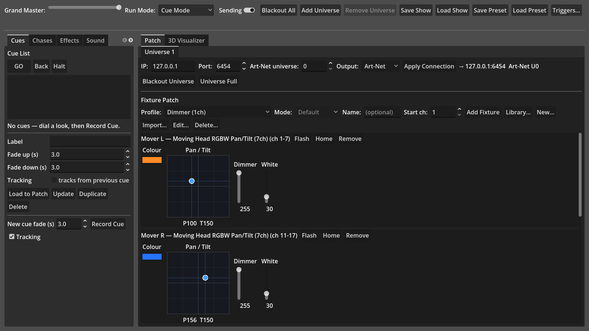
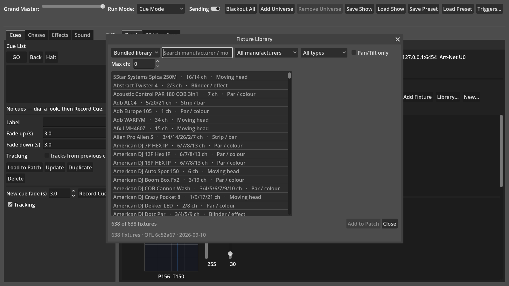
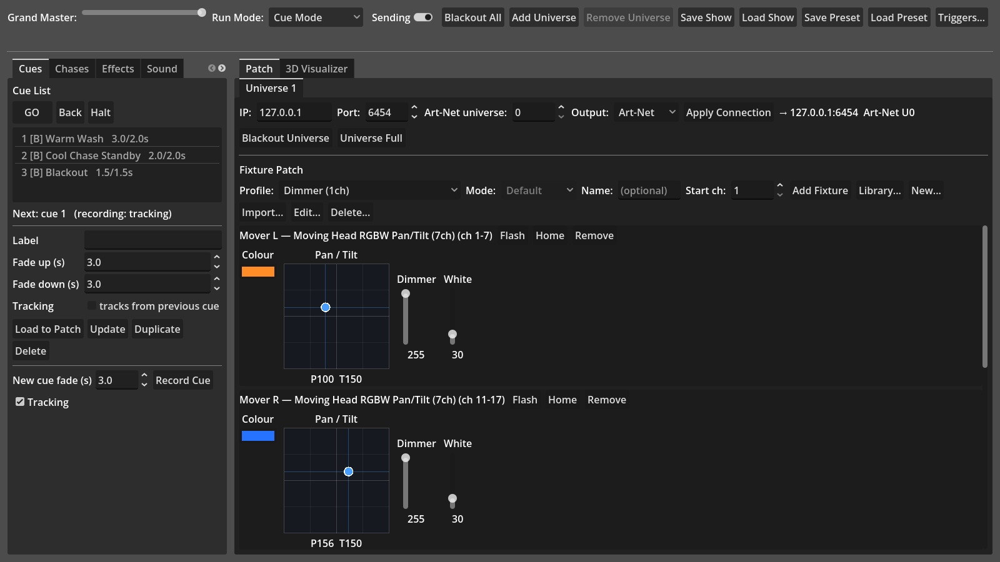
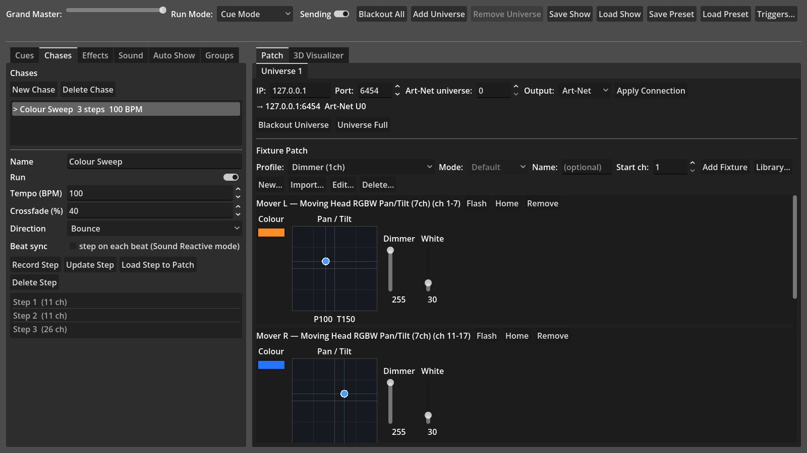
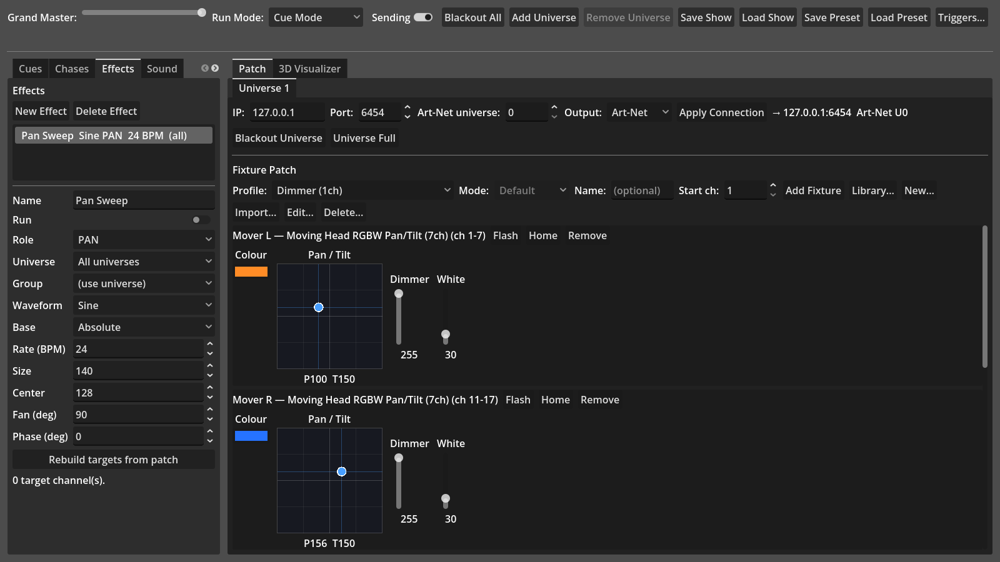
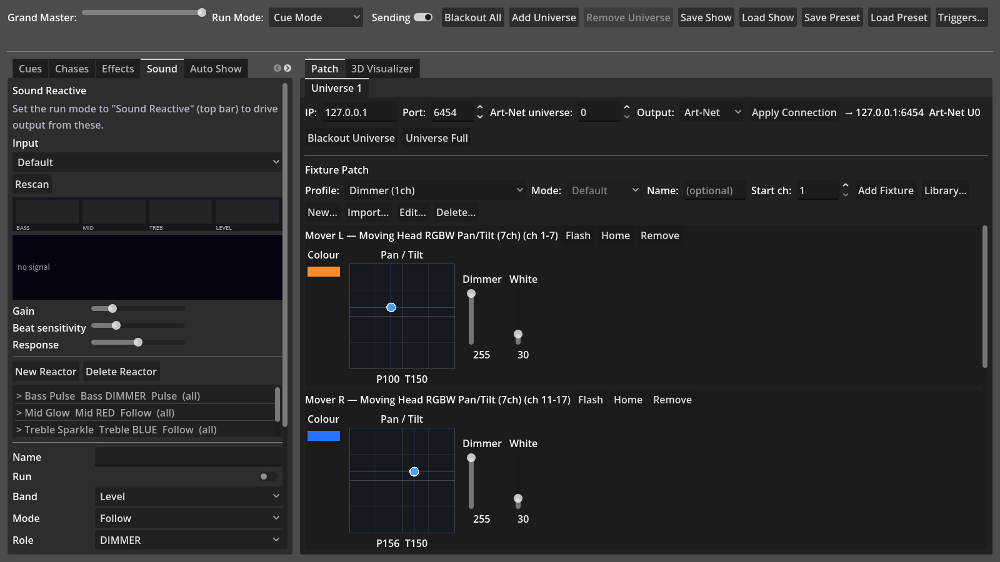
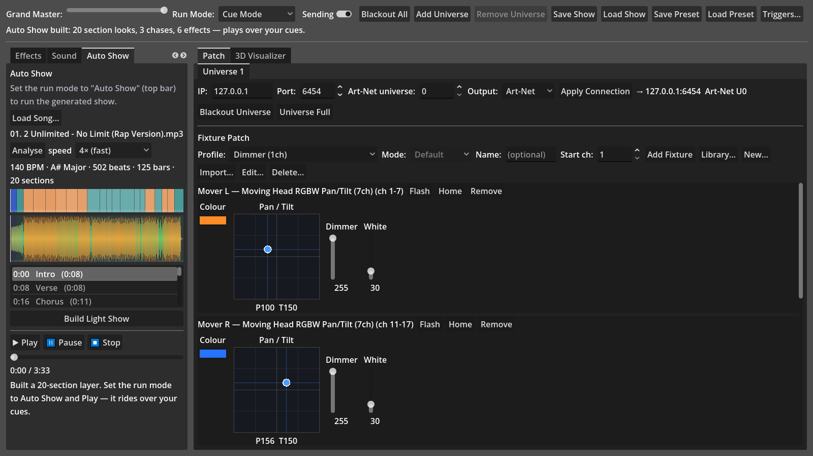
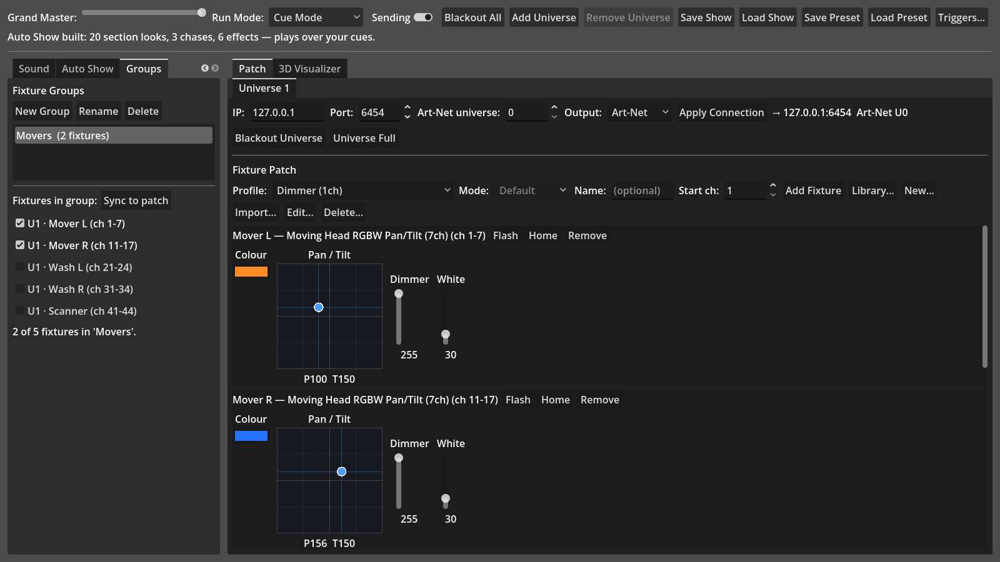
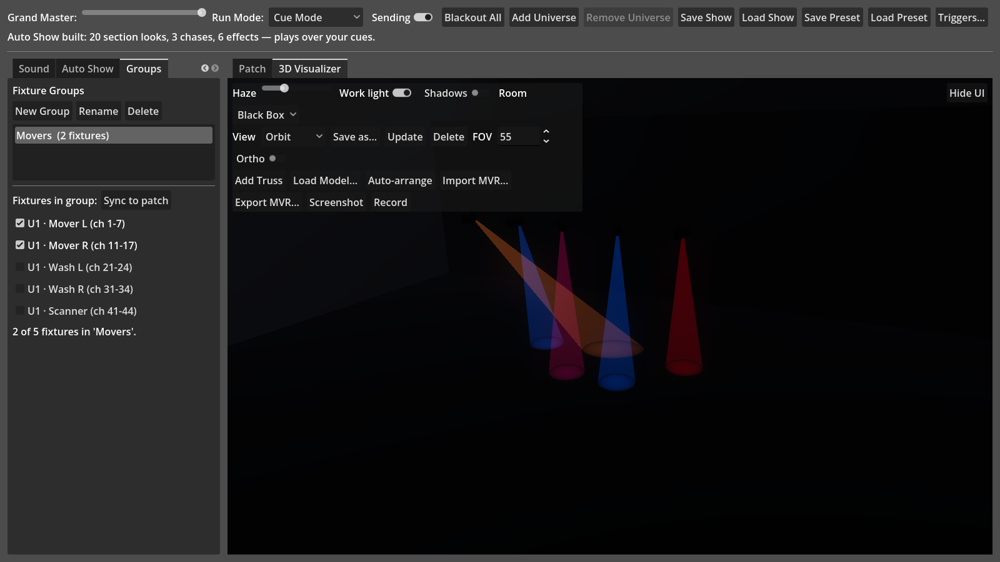
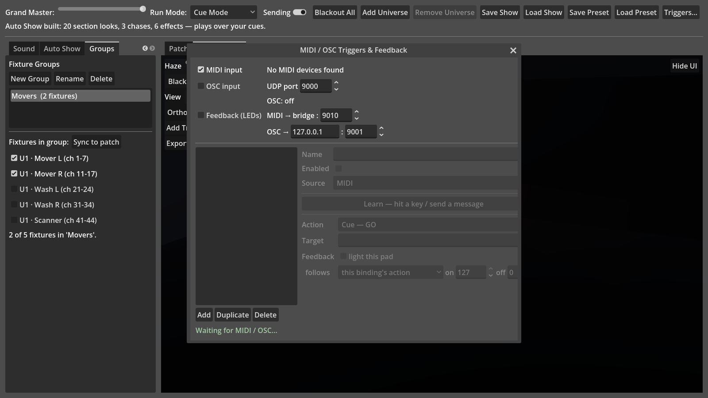

# sLight User Guide

A step-by-step walkthrough for a new user, from opening the app for the
first time to running a show. For a complete technical reference of every
feature, see the [README](../README.md) — this guide focuses on the
essential workflow, in order, with screenshots.

## What you need

sLight controls real (or simulated) DMX lighting fixtures. You don't need
any hardware to follow this guide — see
[Testing without real hardware](../README.md#testing-without-real-hardware)
in the README for a free way to watch the DMX output live (QLC+ or an
Art-Net monitor). When you're ready to control real lights, see
[Going to real fixtures](../README.md#going-to-real-fixtures).

Launch the sLight application — there's no separate setup step, no
account, and no configuration file to edit first. The whole window
you'll see below is what opens.

## The window, at a glance

The window is split into three areas:

- **Top bar** — Grand Master fader, the **Run Mode** selector, **Sending**
  toggle, Add/Remove Universe, Save/Load Show and Preset, and **Triggers…**
  for MIDI/OSC. These are always visible, whatever tab you're on.
- **Left side — playback tabs**: **Cues**, **Chases**, **Effects**,
  **Sound**, **Auto Show**, **Groups**. This is where you build and run a
  show.
- **Right side — Patch / 3D Visualizer**: one tab per universe for
  patching fixtures and dialing them in by hand, and a 3D view of your rig
  lit live by whatever the console is currently outputting.

Everything below walks through these in the order you'd normally use them
for the first time.

## Step 1 — Add a universe and connect it

Each **Universe** tab (right side) is one 512-channel DMX universe. A
fresh project starts with **Universe 1**. Pick an **Output** — Art-Net is
the default and needs no extra hardware or plugins — set the target (for
Art-Net, the IP/Port/universe number; `127.0.0.1:6454` universe `0` talks
to a monitor running on the same machine), and click **Apply Connection**.
Add more universes from **Add Universe** in the top bar if your rig needs
more than 512 channels.

## Step 2 — Patch your first fixture

"Patching" tells sLight what kind of light is plugged in where. In the
**Fixture Patch** row, pick a **Profile** (a description of the fixture's
DMX channels) and, if it has more than one, a **Mode**. Set the **Start
ch:** to where it sits in the universe, optionally give it a **Name**, and
click **Add Fixture**. Its control panel appears right below — a colour
picker, a pan/tilt pad for moving heads, sliders for everything else (see
the screenshot above).

A handful of generic profiles (Dimmer, RGB, RGBW, a moving head) ship
built in, but real fixtures vary a lot — click **Library…** to search
~640 real fixtures converted from the
[Open Fixture Library](https://open-fixture-library.org):

Search by manufacturer or model, filter by type/channel count/pan-tilt,
preview a fixture's modes and channel layout, then **Add to Patch**. If
you have a GDTF or Open Fixture Library file for something not in the
bundle, **Import…** reads it directly.

## Step 3 — Control a fixture by hand

Every patched fixture gets purpose-built controls (visible in the
screenshot for Step 2):

- A full Red/Green/Blue trio becomes one **colour picker**.
- A **Pan** + **Tilt** pair becomes a 2D pad — drag the puck to aim the
  head.
- Everything else gets its own slider, clamped to its usable range.

**Flash** (hold) snaps that fixture to full white and restores it exactly
on release — handy for finding a fixture in a dark room. **Home** resets
every control to its default. Fixture controls send live DMX output
immediately (roughly 30 times a second, while **Sending** is on) — there's
no separate "apply" step.

## Step 4 — Record your first cues

Once you've dialed in a look you like, switch to the **Cues** tab and
click **Record Cue** — it captures the current output of every universe
as a new cue. Repeat for a few different looks, then step through them
with **GO** (or just press the spacebar) — the whole rig crossfades to
the next cue's look over its fade time.

Select a cue to edit its **label** and **fade up/down** times inline.
**Load to Patch** pulls a cue's stored look back into the fixture
controls so you can tweak it and **Update** to re-record. See the
README's [Cue list](../README.md#cue-list) section for the tracking vs.
block distinction, which matters once you're editing a list of cues that
build on each other.

## Step 5 — Add movement with a chase

A **chase** is a list of captured steps that cycle automatically at a
tempo — good for a repeating colour or position pattern that would be
tedious to step through by hand. On the **Chases** tab, click **New
Chase**, dial a look, click **Record Step**, and repeat for each step in
the pattern.

Set the **Tempo (BPM)**, how much each step **Crossfade**s in from the
last one, and a **Direction** (forward / backward / bounce). Click **Run**
to start it — a chase runs as a layer *on top of* whatever your cues are
doing, so it doesn't disturb your programmed look, and stops cleanly when
you turn it off.

## Step 6 — Layer in an effect

An **effect** is a smooth waveform (sine, triangle, sawtooth, square, or
random) applied continuously to one channel role — a breathing dimmer, a
Pan/Tilt circle, a slow colour swell — without needing to record any
steps.

Pick the **Role** it drives and which fixtures (a **Universe**, or a
**Group** — see Step 9), a **Waveform**, **Rate (BPM)**, and **Size**
(how far it swings). **Fan (deg)** spreads the phase across the fixture
list, so instead of every fixture moving in lockstep you get a chase-like
ripple across the rig — try it with two Pan/Tilt effects 90° out of phase
for a circle. Click **Run** to start it; like chases, effects layer over
your cues without disturbing them.

## Step 7 — React to music live

Set the top bar's **Run Mode** to **Sound Reactive** and switch to the
**Sound** tab to drive output straight from a microphone or line input.

Pick an **Input** device, and a live **bass / mid / treble / level**
meter with a spectrogram shows what's coming in. A **reactor** maps one
band (or the beat) onto a channel role — **Follow** mode tracks the band
continuously (bass into a dimmer swell), **Pulse** mode snaps to full on
every detected beat and releases (a beat-synced flash). A starter set of
four reactors is already here to try — **Bass Pulse**, **Mid Glow**,
**Treble Sparkle**, and **Beat Strobe** (off by default, since it's a lot
more intense than the others) — edit or delete them, or add your own with
**New Reactor**. Tick **Run** on the ones you want active.

## Step 8 — Auto-generate a show from a song

The **Auto Show** tab analyses a music file and builds a whole light show
from its structure automatically.

1. **Load Song…** picks an MP3, OGG, or WAV file.
2. **Analyse** works out the tempo, beat grid, and musical key, then
   segments the song into labelled sections (Intro / Verse / Chorus /
   Bridge / Build / Drop / Outro) by finding which parts repeat and how
   loud they are. The result shows as a **structure strip** over a
   colour-coded **waveform** — click either to seek. If a boundary looks
   slightly off, drag it (it snaps to the nearest bar); right-click a
   section to relabel, split, or delete it.
3. **Build Light Show** turns that structure into a per-section look for
   every fixture kind, plus three generated chases and six movement
   effects — the colours themselves follow the song's detected musical
   key. This is a layer, not a replacement: it plays *over* your own cues.

Set the Run Mode to **Auto Show** and press **Play** — the transport
tracks playback position, and the whole generated show rides on top of
whatever your cues are doing underneath.

## Step 9 — Organize fixtures into groups

The **Groups** tab holds named sets of patched fixtures, so an effect or
reactor can target just "the movers" or "the front truss" instead of a
whole universe.

**New Group**, then tick which patched fixtures belong to it. Pick that
group's name in an effect's or reactor's **Group** field instead of a
universe filter. **Sync to patch** refreshes the checklist after you add
or remove fixtures.

## Step 10 — See it in 3D

The **3D Visualizer** tab (right side, next to Patch) shows your rig lit
live by whatever the console is currently outputting — cues, chases,
effects, and the grand master all show, updating continuously.

Left-drag empty space to orbit the camera, wheel to zoom. **Auto-arrange**
hangs every patched fixture in a tidy grid to start from; drag a fixture
on the floor (or type exact X/Y/Z and heading/tilt) to place it precisely.
**Add Truss** and **Load Model…** bring in rigging and set pieces. **Haze**
adds real volumetric fog so beams show up in the air; **Room** switches
between a few preset spaces. **Screenshot** and **Record** save a still or
an MP4 straight from this view. Drag the **3D Visualizer** tab off the tab
bar to pop it into its own window — handy for a second monitor at
front-of-house.

## Optional: MIDI and OSC control surfaces

**Triggers…** in the top bar (works from any tab) opens the binding
editor, so a MIDI controller or an OSC app like TouchOSC can fire cues,
toggle chases/effects, or trigger a blackout.

Turn on **MIDI input** or **OSC input**, click **Add**, then **Learn** and
play the pad / move the fader / send the message you want bound — the
match fields fill in automatically. Pick an **Action** (Cue GO, a chase or
effect toggle, blackout, …). **Feedback (LEDs)** can light a pad back
based on what it controls, or as a standalone beat/sending/run-mode
indicator. This is entirely optional — most of the app works fine with
just a mouse and keyboard.

## Saving your work

**Save Show** (top bar) writes everything — every universe's connection
settings and patch, cues, chases, effects, groups, MIDI/OSC bindings, and
the Auto Show song/analysis — to one file. **Load Show** brings it all
back. **Save/Load Preset** is a lighter-weight snapshot of just the live
DMX output, for a quick "go back to how it looked a minute ago" without
touching your cue list.

## Where to go next

This guide covers the everyday path from an empty patch to a running
show. The [README](../README.md) is the complete reference — fixture
profile details (multi-mode personalities, 16-bit fine channels, named
value ranges for gobo/colour wheels), sACN and USB DMX output, cue
tracking vs. blocks, MVR import/export, and every run mode's exact
behaviour are all there if you want to go deeper.
